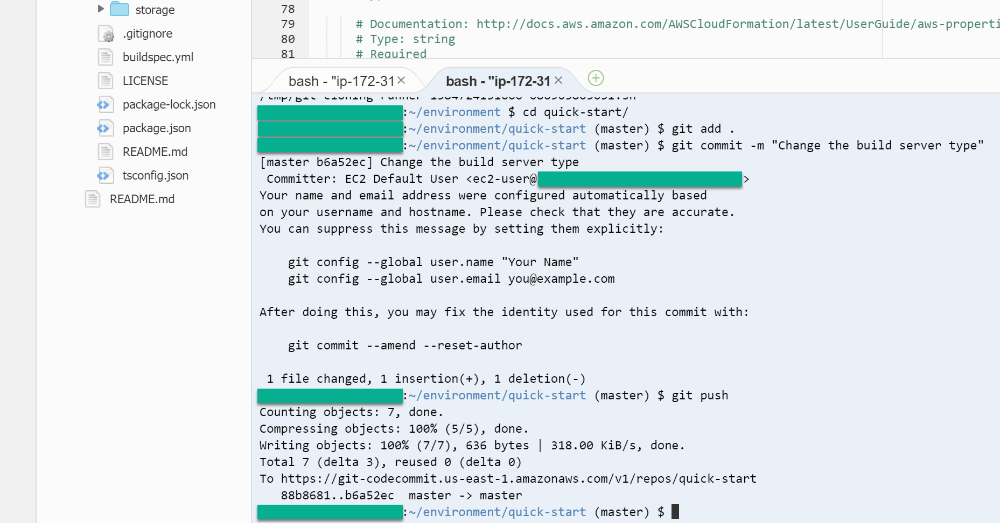
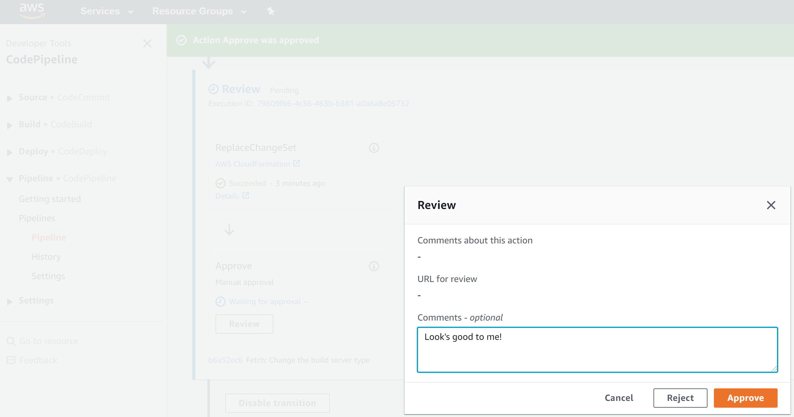

// Add steps as necessary for accessing the software, post-configuration, and testing. Don’t include full usage instructions for your software, but add links to your product documentation for that information.
//Should any sections not be applicable, remove them

== Test the deployment

.  Wait for the Quick Start CloudFormation stack to finish being created.
.  In the https://aws.amazon.com/console[AWS Console^], open the newly created https://aws.amazon.com/cloud9[AWS Cloud9^] environment.
.  Then, try changing some property value in any *props.yaml* file in one of the nested directories in *quick-start/res/*. For example, you could change the build server type from **BUILD_GENERAL1_SMALL** to **BUILD_GENERAL1_MEDIUM** as seen in the screenshot below. You can learn more about **{partner-product-short-name}** and property files https://shi.github.io/crpm[here^].
+ 
[link=images/screenshot1.png]
image::../images/screenshot1.png[Architecture,width=648,height=439]
+
. On the command line, commit the change and push it to AWS CodeCommit to kick off AWS CodePipeline as seen in the screenshot below.
+
[link=images/screenshot2.png]

+
. In the https://aws.amazon.com/console[AWS Console^], open the https://aws.amazon.com/codepipeline[AWS CodePipeline^] that was created.  Then, scroll down to the **Review** stage, click the **Review** button, enter a message, and click the **Approve** button as seen in the screenshot below.
+
NOTE: The first time the Quick Start is launched, the pipeline will run automatically.  You can approve it and let it continue completing, as it will not update anything.
+
[link=images/screenshot3.png]

+
. After the **Deploy** stage has finished, navigate in the console to the resource whose property you changed, and verify that it has changed.

== Best practices for using {partner-product-short-name} on AWS

You can learn more about importing property files into AWS CDK applications with https://shi.github.io/crpm[{partner-product-short-name}^].
