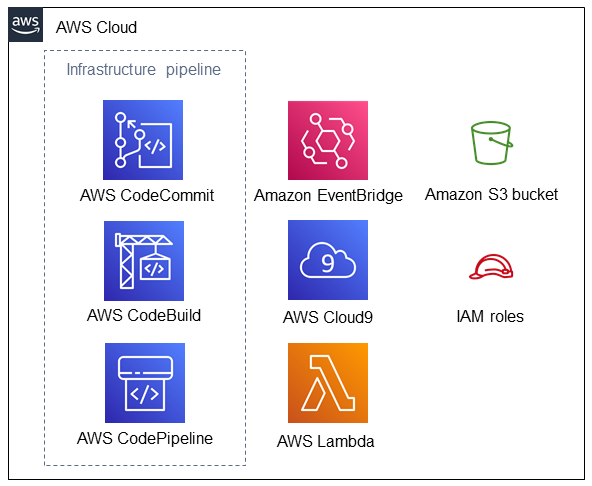

Deploying this Quick Start for an infrastructure CI/CD pipeline and integrated development environment (IDE) with default parameters builds the following {partner-product-short-name} environment in the
AWS Cloud.

// Replace this example diagram with your own. Send us your source PowerPoint file. Be sure to follow our guidelines here : http://(we should include these points on our contributors giude)
[#architecture1]
.Quick Start architecture for {partner-product-short-name} on AWS
[link=images/CRPM-architecture-diagram.jpg]

As shown in Figure 1, the Quick Start sets up the following:

* An infrastructure pipeline that contains:
** AWS CodeCommit to host the repository.
** AWS CodeBuild to test commits that are pushed to the repository.
** AWS CodePipeline to fetch infrastructure code, build and test a CloudFormation template, and review and deploy the infrastructure.
* An Amazon EventBridge rule to invoke AWS CodePipeline.
* An AWS Cloud9 IDE that contains the infrastructure code and installation of {partner-product-short-name}.
* Custom Lambda functions for cloning content to an Amazon S3 bucket.
* Amazon S3 bucket for code artifacts.
* AWS Identity and Access Management (IAM) roles for running Lambda functions and running AWS CodeBuild and AWS CodePipeline.

[#architecture2]
.Process workflow for {partner-product-short-name} Quick Start deployment
[link=images/architecture_diagram_1.png]
image::../images/architecture_diagram_1.png[Architecture,width=648,height=439]

First, AWS CloudFormation provisions a Lambda function that copies the
Quick Start source code into an S3 bucket. The source code initializes the
AWS CodeCommit repository when it's created.

Next, AWS CloudFormation creates an AWS Cloud9 environment and runs
an automation document to install {partner-product-short-name}. Now, {partner-product-short-name} is available to use when the IDE is opened.
The AWS CodeCommit repository is also cloned into the AWS Cloud9 IDE for editing the infrastructure code.

In the AWS Cloud9 IDE, after editing the infrastructure code and then committing and pushing the updates,
AWS CodePipeline fetches the source from AWS CodeCommit, synthesizes a CloudFormation template
from AWS CDK code, validates the template, and then creates a change set. After a manual approval, the change set runs, and the infrastructure is updated.