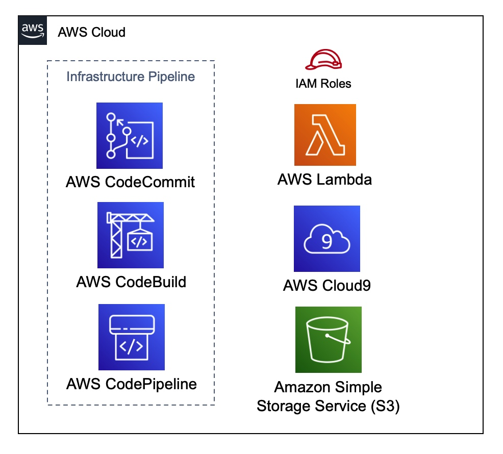
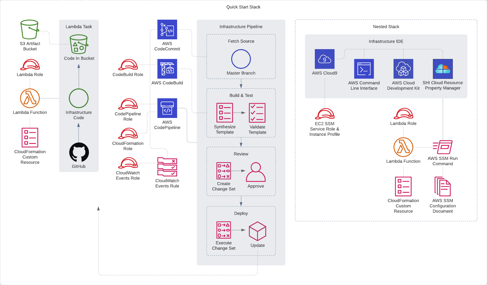

Deploying this Quick Start for an infrastructure CI/CD pipeline and IDE with
default parameters builds the following _{partner-product-short-name}_ environment in the
AWS Cloud.

// Replace this example diagram with your own. Send us your source PowerPoint file. Be sure to follow our guidelines here : http://(we should include these points on our contributors giude)
[#architecture1]
.Quick Start architecture for _{partner-product-short-name}_ on AWS
[link=images/architecture_diagram.jpg]

As shown in Figure 1, the Quick Start sets up the following:

* AWS CodeCommit hosting a repository
* AWS CodeBuild to test commits pushed to the repository
* AWS CodePipeline for management of the source repository, build tests, manual review and deployment of the repository code.
* An EventBridge rule for triggering AWS CodeBuild projects.
* IAM Roles
* An AWS Cloud9 IDE containing the infrastructure code and {partner-product-short-name} installed.
* Custom Lambda resources
* S3 bucket for code artifacts

[#architecture2]
.Process workflow for _{partner-product-short-name}_ Quick Start deployment
[link=images/architecture_diagram_1.png]

Figure 2 shows the ...