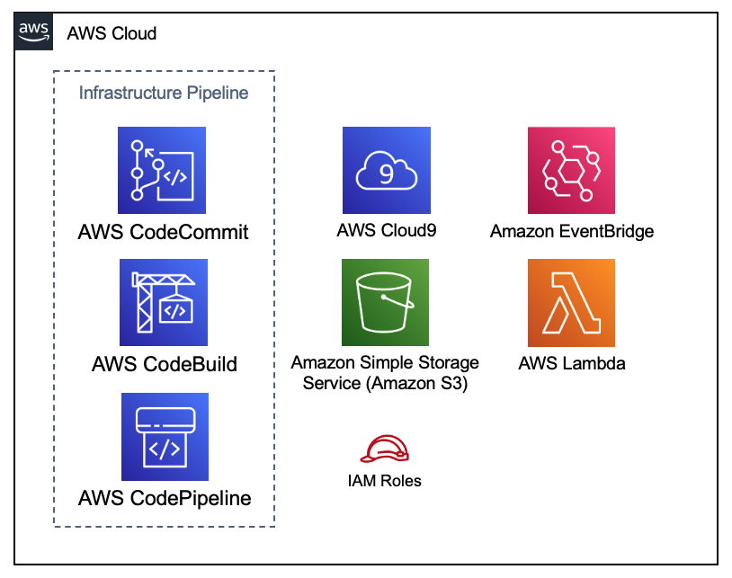

// DONE
Deploying this Quick Start for an infrastructure CI/CD pipeline and IDE with
default parameters builds the following _{partner-product-short-name}_ environment in the
AWS Cloud.

// Replace this example diagram with your own. Send us your source PowerPoint file. Be sure to follow our guidelines here : http://(we should include these points on our contributors giude)
[#architecture1]
.Quick Start architecture for _{partner-product-short-name}_ on AWS
[link=images/architecture_diagram.png]

As shown in Figure 1, the Quick Start sets up the following:

* An infrastructure CI/CD pipeline.
* An AWS Cloud9 IDE with infrastructure code checked out and {partner-product-short-name} installed.

In the AWS Cloud9 IDE:

* The AWS CodeCommit repository that is created by the Quick Start, is
cloned in the IDE.  This allows you to easily edit the infrastructure
code, commit and push changes from the IDE to trigger the pipeline to update
the infrastructure.
* {partner-product-short-name} is installed in the IDE, so that you are ready to
import additional resource property templates into the CDK application.
